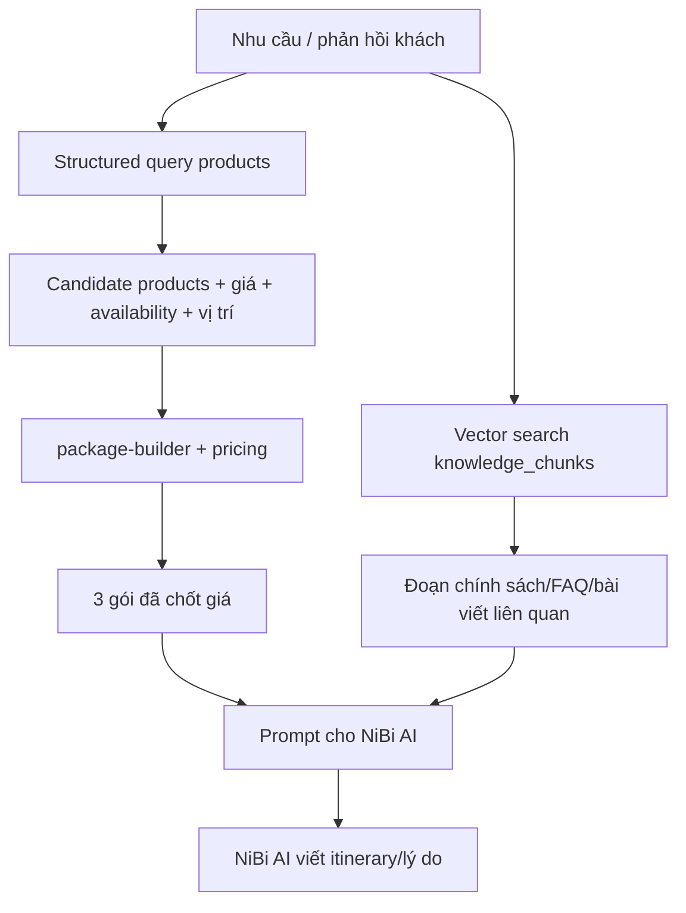

# AI Design — NiBiGo AI Travel Platform (NiBi AI)

Phân vai backend vs NiBi AI, công thức fit score, thuật toán dựng gói, prompt, RAG, guardrails.

> **Nguyên tắc tối thượng:** Backend tính tiền, NiBi AI viết lời.
> NiBi AI **không** tự tính tổng giá cuối, **không** bịa sản phẩm/giá/vị trí/tình trạng chỗ.
> NiBi AI chỉ chọn trong **candidate list** do backend cung cấp và tham chiếu sản phẩm bằng `id`.
> NiBi AI **không** tự đổi trạng thái booking/order, **không** tự nói "đã thanh toán/đã xác nhận".

---

## 1. Phân chia trách nhiệm

### Backend / code (nguồn sự thật)
- Lọc sản phẩm theo `destination`, `availability_status`, ngân sách, loại dịch vụ (tour/homestay/hotel/restaurant/transport/combo).
- Tính **fit score** (công thức §3).
- Dựng 3 gói theo tier (§4).
- **Tính giá + cost breakdown từ DB** (`lib/engine/pricing.ts`).
- Kiểm tra ngân sách, kiểm `availability_status`.
- Áp dụng thao tác chỉnh tour (đã được NiBi AI parse thành cấu trúc) — `lib/engine/apply-revision.ts`.
- Tạo booking request / order, sinh mã, lưu DB, ghi `booking_status_logs`/`order_status_logs`, phân quyền theo role.

### NiBi AI (ngôn ngữ + tư vấn)
- Hiểu nhu cầu khách (kể cả `special_requests` dạng free text).
- Hỏi thêm khi thiếu thông tin quan trọng — hỏi ít nhưng đúng trọng tâm.
- Viết **itinerary** hấp dẫn từ danh sách sản phẩm đã chốt.
- Giải thích **vì sao gói phù hợp** (recommendation reason).
- Diễn giải **phản hồi chỉnh tour** thành thao tác có cấu trúc.
- Viết **AI sales note** cho Sales.

### Ranh giới tuyệt đối

| Việc | Ai làm |
|---|---|
| Chọn sản phẩm nào vào gói | Backend đề xuất candidate; NiBi AI có thể sắp xếp/chọn **trong** candidate; backend chốt |
| Tính `total_price`, `cost_breakdown` | **Chỉ backend** |
| Quyết định `availability_status` | **Chỉ backend** (từ DB) |
| Vị trí Google Maps (lat/lng/address) | **Chỉ backend/Editor nhập**, NiBi AI chỉ nhắc tên địa điểm |
| Tạo/đổi trạng thái booking/order/payment | **Chỉ backend** (Sales/Admin thao tác qua route handler) |
| Văn phong itinerary, lý do, sales note | **Chỉ NiBi AI** |
| Featured listing có ảnh hưởng ranking gợi ý? | **Không** — fit score tính thuần theo nhu cầu khách, không cộng điểm vì trả phí cao hơn |

## 2. AI provider abstraction

`lib/ai/provider.ts` định nghĩa interface, đổi OpenAI ↔ Gemini qua env `AI_PROVIDER`:

```ts
export interface AIProvider {
  // Trả về JSON đã parse theo schema; ném lỗi nếu không parse được
  generateJSON<T>(args: {
    system: string;
    user: string;
    schema: ZodSchema<T>;
    temperature?: number;
  }): Promise<T>;

  generateText(args: { system: string; user: string; temperature?: number }): Promise<string>;

  embed(text: string): Promise<number[]>;
}
```
- MVP default: `gpt-4o-mini` hoặc `gemini-1.5-flash` (rẻ, đủ tốt).
- Dùng JSON mode / response_format khi sinh dữ liệu có cấu trúc.
- Mọi lời gọi LLM **chạy server-side**; key không lộ client.

## 3. Fit Score (backend tính, 0–100)

Trọng số đúng theo đề bài:

```
FitScore = 30 * budget_match
         + 25 * interest_match
         + 20 * group_match
         + 15 * duration_match
         + 10 * quality_priority
```
Mỗi thành phần là số thực trong `[0, 1]`; tổng tối đa 100. Áp dụng ở **2 cấp**: chấm điểm từng
sản phẩm khi lọc, và chấm điểm cả gói để hiển thị.

### 3.1 budget_match (30%)
So tổng giá gói (`pkgTotal`) với ngân sách (`budget`):
```
ratio = pkgTotal / budget
budget_match =
  1.0                      nếu 0.85 ≤ ratio ≤ 1.0      (vừa/sát ngân sách = tốt nhất)
  0.8                      nếu 0.7  ≤ ratio < 0.85      (rẻ hơn nhiều)
  max(0, 1 - (ratio-1)*2)  nếu ratio > 1.0             (vượt ngân sách bị phạt mạnh)
  0.6                      nếu ratio < 0.7              (quá rẻ, có thể thiếu chất)
```

### 3.2 interest_match (25%)
Độ trùng giữa `interests` của khách và `tags` các sản phẩm trong gói:
```
interest_match = |union(product.tags) ∩ interests| / max(1, |interests|)
```
(clamp về `[0,1]`; có thể cộng nhẹ nếu nhiều sản phẩm cùng khớp một interest).

### 3.3 group_match (20%)
Mức phù hợp `suitable_for` với `group_composition`:
```
- couple (adults=2, children=0)  → ưu tiên suitable_for chứa 'couple'
- family (children>0)            → ưu tiên 'family'/'kids'
- có elderly>0                   → ưu tiên 'elderly-friendly', phạt 'active' nặng
group_match = tỉ lệ sản phẩm trong gói có suitable_for khớp nhóm khách
```

### 3.4 duration_match (15%)
Lịch có "vừa sức" với `num_days` và phong cách không:
```
- Ước tổng duration_hours/ngày.
- relaxing: lý tưởng ~4–6h hoạt động/ngày; active: ~7–9h.
- Lệch càng xa lý tưởng → điểm càng thấp.
duration_match = 1 - clamp(|avgHoursPerDay - ideal| / ideal, 0, 1)
```

### 3.5 quality_priority (10%)
Trung bình `quality_score` (1–5) của sản phẩm, chuẩn hóa:
```
quality_priority = avg(product.quality_score) / 5
```

> Tất cả công thức trên là **minh bạch, không hộp đen** — đặt trong `lib/engine/scoring.ts`,
> có thể log/giải thích. Không dùng LLM để chấm điểm. **Không có biến số "featured"/"trả phí
> cao hơn" trong công thức này** — đúng nguyên tắc chống ưu tiên ngầm.

## 4. Thuật toán dựng 3 gói (`package-builder.ts`)

Input: `trip_request` + danh sách `products` (status=`published`, `is_active`, đúng
`destination`, loại bỏ `availability_status = 'sold_out'`).

```
1. Phân ngân sách theo tier:
   - budget  : mục tiêu ~0.75 * budget
   - balanced: mục tiêu ~0.98 * budget
   - premium : mục tiêu ~1.20 * budget
2. Với mỗi tier, chọn theo "khung" 1 chuyến cần:
   - transport (nếu special_requests/đề cập đón từ HN → bắt buộc có)
   - chỗ ở (hotel/homestay): num_nights đêm (price_unit=per_night × num_nights × số phòng)
   - activity/tour: ~1–3/ngày tùy travel_style (relaxing ít hơn)
   - restaurant: 1–2 bữa đặc sản/ngày
   - combo: có thể thay thế trực tiếp 1 khung (vd combo đã gộp tour+ăn)
3. Trong mỗi khung, ưu tiên sản phẩm có fit score cao + giá phù hợp tier:
   - budget  → ưu tiên tag 'budget', quality vừa phải, giá thấp
   - balanced→ cân bằng giá/chất, bám interests
   - premium → ưu tiên 'premium'/'relaxing'/quality cao
4. pricing.ts tính line_total từng item (nhân số người/đêm/nhóm theo price_unit)
   → total_price + cost_breakdown. KHÔNG để NiBi AI đụng vào.
5. Tính fit_score cho cả gói.
6. Nếu sản phẩm `availability_status = 'limited'` → vẫn cho vào gói nhưng đánh cờ cảnh báo;
   nếu `need_confirmation` → đánh cờ "cần Sales xác nhận trước khi tạo order tức thời".
7. Nếu vượt/thiếu ngân sách quá ngưỡng → thử hoán đổi 1–2 sản phẩm rồi tính lại.
```

Cấu trúc gói (trước khi đưa NiBi AI viết lời):
```json
{
  "tier": "balanced",
  "items": [
    { "product_id": "...", "type": "transport", "day": 1, "slot": "morning", "quantity": 1, "unit_price": 1000000, "line_total": 1000000 },
    { "product_id": "...", "type": "hotel", "quantity": 2, "unit_price": 950000, "line_total": 1900000 }
  ],
  "total_price": 7800000,
  "cost_breakdown": { "transport": 1000000, "hotel": 1900000, "activity": 1500000, "restaurant": 2100000, "other": 1300000, "total": 7800000 },
  "fit_score": 86,
  "needs_confirmation": false
}
```

## 5. Quy tắc tính giá (`pricing.ts`)

```
line_total = unit_price * multiplier(price_unit)

multiplier:
  per_person  → num_people
  per_night   → num_nights * num_rooms     (num_rooms = ceil(num_people / 2) mặc định)
  per_vehicle → num_vehicles (mặc định 1, tăng nếu nhóm lớn)
  per_package → 1
  per_booking → 1
```
- `cost_breakdown` cộng `line_total` theo `type` (hotel/homestay/activity/restaurant/transport/combo) + `other`.
- `total_price = sum(cost_breakdown)`. **Đây là con số duy nhất hiển thị cho khách.**
- Order/cart dùng cùng `pricing.ts`; cộng thêm `platform_fee` nếu áp dụng (cấu hình ở Admin §settings).
- NiBi AI nếu có nhắc số tiền trong văn bản → backend hậu kiểm/ghi đè bằng số này.

## 6. RAG

### 6.1 Hai loại retrieval
1. **Structured retrieval (chính, cho dựng gói):** query SQL trên `products` theo
   destination/type/tags/availability/giá. Đáng tin, không ảo giác. Đây là "RAG sản phẩm".
2. **Vector retrieval (cho tư vấn/giải thích):** `knowledge_chunks` (pgvector) chứa chính sách,
   FAQ, bài viết/guide đã publish, đặc điểm điểm đến (vd "Hang Múa leo ~500 bậc, không hợp
   người ngại mệt"). Dùng khi NiBi AI viết lý do, trả lời câu hỏi, hoặc xử lý chỉnh tour.

### 6.2 Luồng RAG khi sinh/chỉnh tour


### 6.3 Chống ảo giác
- Prompt **chỉ** chứa sản phẩm hợp lệ (id + name + type + tags + giá + vị trí ngắn). NiBi AI
  phải tham chiếu bằng `id`.
- Output validate: mọi `product_id` NiBi AI trả phải tồn tại trong candidate; sai → loại.
- Không đưa giá "mục tiêu" cho NiBi AI như con số chốt; con số chốt do backend gắn sau.

## 7. Prompt (mẫu rút gọn)

### 7.1 System prompt (chung)
```
Bạn là NiBi AI — trợ lý lập kế hoạch & tư vấn du lịch Ninh Bình của NiBiGo AI Travel Platform.
QUY TẮC BẮT BUỘC:
- Chỉ dùng các sản phẩm trong DANH SÁCH được cung cấp; tham chiếu bằng "product_id".
- TUYỆT ĐỐI không bịa sản phẩm, không bịa giá, không bịa vị trí, không bịa tình trạng chỗ.
- KHÔNG tự tính hay khẳng định tổng giá cuối cùng; tổng giá do hệ thống tính.
- KHÔNG khẳng định booking/order đã được xác nhận hay đã thanh toán; trạng thái do hệ thống quản lý.
- Văn phong tiếng Việt, ấm áp, gọn, đúng trọng tâm, hợp du lịch nghỉ dưỡng.
- Nếu thiếu thông tin quan trọng, nêu rõ cần hỏi gì.
Trả về đúng JSON theo schema yêu cầu, không thêm chữ ngoài JSON.
```

### 7.2 Sinh itinerary + lý do (task `generateItinerary`)
- **User content:** nhu cầu khách (đã chuẩn hóa) + gói đã chốt (`tier`, `items` với id/name/type/tags/day/slot) + vài đoạn RAG liên quan.
- **Output schema (zod):**
```ts
const ItinerarySchema = z.object({
  name: z.string(),                        // tên gói hấp dẫn
  recommendation_reason: z.string(),       // vì sao hợp khách
  conditions: z.array(z.string()),         // điều kiện cần Sales xác nhận
  itinerary: z.array(z.object({
    day: z.number(),
    title: z.string(),
    slots: z.array(z.object({
      time: z.enum(['morning', 'noon', 'afternoon', 'evening']),
      product_id: z.string(),              // PHẢI thuộc candidate
      description: z.string()              // mô tả trải nghiệm (không nêu giá)
    }))
  }))
});
```
- Gọi **1 lần cho cả 3 gói** (batch) để tiết kiệm token, hoặc tuần tự nếu cần rõ ràng.

### 7.3 Chỉnh tour (task `parseRevision`)
- **User content:** gói hiện tại (items) + câu phản hồi tự nhiên của khách.
- **Output schema:** danh sách thao tác có cấu trúc, backend mới thực thi:
```ts
const RevisionSchema = z.object({
  intent_summary: z.string(),
  operations: z.array(z.discriminatedUnion('op', [
    z.object({ op: z.literal('remove'), product_id: z.string() }),
    z.object({ op: z.literal('add_like'), tags: z.array(z.string()), avoid_tags: z.array(z.string()).optional(), day: z.number().optional() }),
    z.object({ op: z.literal('replace'), product_id: z.string(), tags: z.array(z.string()) }),
    z.object({ op: z.literal('set_intensity'), level: z.enum(['lighter', 'heavier']) }),
    z.object({ op: z.literal('adjust_budget'), direction: z.enum(['down', 'up']) })
  ]))
});
```
- Backend (`apply-revision.ts`) thực thi: bỏ/thay/thêm sản phẩm từ candidate phù hợp tags,
  **tính lại giá**, rồi gọi lại `generateItinerary` để viết lại lời.

> Ví dụ: "Bỏ Hang Múa vì sợ mệt, thêm hoạt động nhẹ" →
> `[{op:'remove', product_id:'hang-mua'}, {op:'add_like', tags:['relaxing','culture'], avoid_tags:['active']}, {op:'set_intensity', level:'lighter'}]`.

### 7.4 AI sales note (task `generateSalesNote`)
- **User content:** trip_request + gói được đặt (tóm tắt) + tổng giá (từ backend) + booking/order code.
- **Output:** text ngắn 2–4 câu cho Sales. Ví dụ mục tiêu (khớp demo):
  > "Khách ưu tiên lịch nhẹ, trải nghiệm cặp đôi, ngân sách ~8 triệu. Nên xác nhận khách sạn
  > view đẹp, giữ dinner set và tư vấn lịch trình không quá dày."

## 8. Xử lý lỗi & fallback

| Lỗi | Xử lý |
|---|---|
| NiBi AI trả JSON sai/parse fail | Retry 1 lần với nhắc schema; vẫn fail → **fallback template**: itinerary tự sinh từ items theo ngày/slot, lý do mặc định. Gói vẫn có giá + sản phẩm. |
| `product_id` NiBi AI trả không hợp lệ | Loại slot đó, log; giữ phần còn lại |
| NiBi AI nêu số tiền sai | Backend ghi đè bằng `total_price`/`cost_breakdown` |
| NiBi AI timeout | Hiển thị gói backend-only + nút "Tạo mô tả lại" |
| Provider lỗi/hết quota | Đổi provider qua env, hoặc fallback template |

## 9. Chi phí & hiệu năng
- Model rẻ cho MVP; `temperature` thấp (0.3–0.6) cho ổn định.
- Gộp 3 gói trong 1 prompt khi sinh itinerary để giảm số lần gọi.
- Cache phần system prompt tĩnh; chỉ phần candidate/nhu cầu thay đổi.
- Giới hạn số lần revise/phút mỗi user (chống đốt token).
- Log token usage để theo dõi metric chi phí (PRD §8.2).

## 10. Đánh giá chất lượng AI (nhẹ, cho solo)
- **Kiểm tra "không bịa":** test rằng mọi `product_id` trong output đều thuộc candidate.
- **Kiểm tra "đúng giá":** `total_price` UI == tổng `line_total` từ DB (không phụ thuộc text NiBi AI).
- **Kiểm tra "không tự xác nhận":** test rằng output không chứa câu khẳng định trạng thái booking/order/payment.
- **Spot-check văn phong:** 5–10 mẫu itinerary đọc tự nhiên, đúng nhu cầu.
- **Kịch bản demo** ([DEMO_SCRIPT.md](DEMO_SCRIPT.md)) chạy ổn định, lặp lại được.
