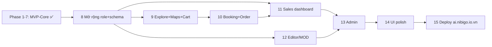

# Roadmap — NiBiGo AI Travel Platform

Lộ trình build theo phase. **Không code tất cả cùng lúc.** Mỗi phase có: mục tiêu, file tạo/sửa,
tiêu chí hoàn thành, cách test. Làm xong + test xong một phase mới sang phase kế.

> Quy ước: ✅ = Definition of Done của phase đó. **Phase 1–7 (MVP-Core) đã build xong** theo mô
> hình 2-role ban đầu — xem trạng thái thật ở [README.md](../README.md) §10. Phase 8 trở đi là
> **mở rộng** lên 4 role + full commerce, theo quyết định scope mới nhất.

---

## MVP-Core (đã build) — Phase 1–7

| Phase | Mục tiêu | Trạng thái |
|---|---|---|
| 1 | Project setup (Next.js + Tailwind + Supabase client + landing) | ✅ |
| 2 | Auth + DB schema (2-role: guest/admin) + RLS + demo users | ✅ code xong, chờ chạy migration |
| 3 | Travel product catalog (5 loại, seed 26 sản phẩm) + admin CRUD | ✅ |
| 4 | Trip request form + dashboard guest | ✅ |
| 5 | Tour generation engine (filter/scoring/pricing/package-builder) | ✅ |
| 6 | AI itinerary/explanation (OpenAI, JSON mode, fallback template) | ✅ |
| 7 | Booking flow + chỉnh tour bằng NL (revise + sales note) | ✅ |

Chi tiết kỹ thuật từng phase này: xem README.md §10 (giữ nguyên, không viết lại ở đây để
tránh trùng lặp).

---

## Phase 8 — Mở rộng role & schema (Buyer/Sales/Editor-MOD/Admin)
**Mục tiêu:** nâng cấp từ 2 role (guest/admin) lên **4 role**, mở rộng schema theo
[DATA_SCHEMA.md](DATA_SCHEMA.md) §11 (migration path), **chưa cần UI mới** — chỉ data + auth + RLS.

**File tạo/sửa:**
- `supabase/migrations/0004_expand_roles_commerce.sql`: enum `user_role` thêm `sales`/`editor`,
  đổi `guest`→`buyer`; rename `travel_products`→`products` + thêm cột `status`, `created_by`;
  thêm bảng mới (§3–§7 DATA_SCHEMA): `product_images`, `product_locations`, `articles`,
  `cart_items`, `saved_products`, `recently_viewed_products`, `orders`, `order_items`,
  `order_status_logs`, `payments`, `sales_notes`, `notification_events`, `audit_logs`.
- `supabase/migrations/0005_rls_4roles.sql`: policy mới theo role.
- `middleware.ts`: cập nhật guard cho `/buyer/*`, `/sales/*`, `/editor/*`, `/admin/*`.
- `supabase/seed/seed_v2.sql`: demo users 4 role + seed mở rộng (homestay, articles, locations).

**✅ Hoàn thành khi:**
- Migration chạy sạch, không phá dữ liệu cũ.
- 4 demo user, mỗi user vào đúng route nhóm role, bị chặn nhóm khác.
- RLS test: Buyer chỉ thấy dữ liệu của mình; Sales/Editor/Admin theo đúng bảng phân quyền.

**Cách test:** chạy migration trên project Supabase demo; đăng nhập từng role, thử truy cập
route role khác → bị chặn; query trực tiếp DB kiểm RLS qua từng role token.

---

## Phase 9 — Buyer: Explore + Maps + Cart
**Mục tiêu:** Buyer khám phá dịch vụ đa loại, xem vị trí Google Maps, dùng cart.

**File tạo/sửa:**
- `src/app/(buyer)/buyer/explore/page.tsx`, `buyer/products/[id]/page.tsx`
- `src/components/product/ProductCard.tsx`, `ProductDetail.tsx`, `MapView.tsx`, `MapMarker.tsx`
- `src/lib/maps/client.ts`, `geocode.ts`
- `src/app/(buyer)/buyer/cart/page.tsx`, `src/app/api/cart/route.ts`

**✅ Hoàn thành khi:**
- Danh mục lọc theo loại/giá/tag/availability; chi tiết sản phẩm hiển thị bản đồ đúng vị trí.
- Cart thêm/sửa/xóa, tính tổng đúng từ `pricing.ts`.

**Cách test:** thêm 3 sản phẩm khác loại vào cart, kiểm tổng tiền == tổng `unit_price*quantity`; mở Maps thấy marker đúng toạ độ seed.

---

## Phase 10 — Booking request + Order (commerce đầy đủ)
**Mục tiêu:** nâng booking flow hiện có lên route `/buyer/*` mới + thêm luồng order/checkout.

**File tạo/sửa:**
- `src/app/(buyer)/buyer/booking-request/[id]/page.tsx`, `buyer/orders/[id]/page.tsx`, `buyer/bookings/page.tsx`
- `src/app/api/orders/route.ts`, `orders/[id]/status/route.ts`
- `src/components/booking/StatusBadge.tsx`, `StatusHistoryList.tsx`

**✅ Hoàn thành khi:**
- Booking request giữ nguyên logic cũ (mã `NBG-YYYY-NNNN`, AI sales note) trên route mới.
- Order: tạo từ cart, mã `NBO-YYYY-NNNN`, `payment_status` demo/manual, theo state machine [USER_FLOW.md](USER_FLOW.md) §6.3.

**Cách test:** tạo booking request + tạo order riêng biệt; kiểm 2 luồng độc lập, không lẫn mã.

---

## Phase 11 — Sales dashboard
**Mục tiêu:** Sales xử lý booking/order với đầy đủ state machine mở rộng.

**File tạo/sửa:**
- `src/app/(sales)/sales/dashboard/page.tsx`, `sales/bookings/page.tsx`, `sales/bookings/[id]/page.tsx`, `sales/orders/page.tsx`
- `src/components/booking/StatusSelect.tsx`, `SalesNoteCard.tsx`
- `src/app/api/bookings/[id]/status/route.ts` (mở rộng đủ 7 trạng thái), `orders/[id]/status/route.ts`

**✅ Hoàn thành khi:**
- Đổi trạng thái booking đủ `NEW→CONTACTED→CHECKING_AVAILABILITY→WAITING_PAYMENT→CONFIRMED/CANCELLED→COMPLETED`.
- Đổi trạng thái order đủ pipeline ở USER_FLOW.md §6.3, ghi `order_status_logs`.
- AI sales note hiển thị đúng, ghi chú nội bộ lưu được.

**Cách test:** đi hết một booking từ NEW→COMPLETED, kiểm `booking_status_logs` đủ dòng; thử Buyer gọi API đổi trạng thái → bị chặn.

---

## Phase 12 — Editor/MOD: Product & Article management
**Mục tiêu:** Editor tạo/sửa sản phẩm đủ loại + vị trí Maps + bài viết, qua pipeline duyệt.

**File tạo/sửa:**
- `src/app/(editor)/editor/products/page.tsx`, `products/[id]/edit/page.tsx`
- `src/components/product/ProductForm.tsx` (đủ field + input lat/lng/address + geocode preview)
- `src/app/(editor)/editor/articles/page.tsx`, `articles/[id]/edit/page.tsx`
- `src/app/api/articles/route.ts`

**✅ Hoàn thành khi:**
- Tạo sản phẩm mới đủ loại, lưu `DRAFT`, gửi `PENDING_REVIEW`.
- Tạo bài viết, gắn sản phẩm liên quan, gửi duyệt.
- Editor chỉ sửa được sản phẩm/bài viết của mình (RLS).

**Cách test:** tạo 1 sản phẩm mỗi loại + 1 bài viết, gửi duyệt; thử sửa sản phẩm của Editor khác → bị chặn.

---

## Phase 13 — Admin dashboard đầy đủ
**Mục tiêu:** Admin quản lý user/role, duyệt nội dung, giám sát toàn nền tảng, audit log.

**File tạo/sửa:**
- `src/app/(admin)/admin/dashboard/page.tsx`, `admin/users/page.tsx`, `admin/approvals/page.tsx`, `admin/bookings/page.tsx`, `admin/orders/page.tsx`, `admin/audit-logs/page.tsx`
- `src/app/api/admin/approvals/[id]/route.ts`

**✅ Hoàn thành khi:**
- Gán/gỡ role cho user; duyệt/từ chối sản phẩm + bài viết `PENDING_REVIEW`.
- Xem toàn bộ booking/order (không chỉ của Sales phụ trách); xem audit log.
- Dashboard analytics tổng quan (số liệu theo trạng thái, theo loại sản phẩm).

**Cách test:** duyệt 1 sản phẩm `PENDING_REVIEW` → thấy xuất hiện ở Buyer explore; đổi role 1 user → user đó vào đúng route mới sau khi đăng nhập lại.

---

## Phase 14 — UI polish (4 role)
**Mục tiêu:** đạt cảm giác **travel-premium**, responsive, nhất quán cho cả 4 role.

**File tạo/sửa:**
- `tailwind.config.ts` (design tokens — xem SYSTEM_ARCHITECTURE.md §9)
- `src/components/ui/*` hoàn thiện
- `src/components/shared/Navbar.tsx` (đổi theo role), `Footer.tsx`, `EmptyState.tsx`, `Loading.tsx`
- Rà toàn bộ sitemap ở [USER_FLOW.md](USER_FLOW.md) cho nhất quán

**✅ Hoàn thành khi:**
- Toàn bộ route 4 role gọn, nhất quán, không vỡ mobile (≥360px).
- Loading/empty/error/permission-denied states đầy đủ.
- Badge trạng thái booking/order/product nhất quán theo tokens.

**Cách test:** chạy lại toàn luồng demo 4 role trên desktop + mobile.

---

## Phase 15 — Deploy lên ai.nibigo.io.vn + chốt DoD
**Mục tiêu:** production, gắn domain, chốt Definition of Done toàn nền tảng.

**File tạo/sửa:**
- Cấu hình env trên Vercel (Supabase keys, AI keys, Google Maps key — **không commit**)
- DNS: CNAME `ai` → Vercel; verify domain
- `README.md`: cập nhật URL production + tài khoản demo 4 role
- (Tùy chọn) CTA trên `nibigo.io.vn` (WordPress) trỏ sang `ai.nibigo.io.vn`

**✅ Hoàn thành khi:**
- `https://ai.nibigo.io.vn` chạy, HTTPS ok.
- 4 tài khoản demo hoạt động trên production.
- Toàn bộ checklist [MVP_SCOPE.md](MVP_SCOPE.md) §4 đạt.

**Cách test:** chạy nguyên kịch bản [DEMO_SCRIPT.md](DEMO_SCRIPT.md) trên domain production từ máy/thiết bị khác.

---

## Bảng phụ thuộc giữa các phase

## Ước lượng & thứ tự ưu tiên
- **Đã có (lõi giá trị AI):** Phase 1–7 — đừng động lại trừ khi migration ở Phase 8 yêu cầu.
- **Ưu tiên mở rộng:** Phase 8 (nền tảng schema/role) → Phase 9–10 (Buyer commerce) → Phase 11 (Sales, để có người xử lý booking/order mới) → Phase 12 (Editor, để có dữ liệu sản phẩm mới) → Phase 13 (Admin, giám sát) → Phase 14–15.
- Mẹo: sau **Phase 11** đã đủ để demo lại toàn bộ luồng Buyer→Sales với scope mới; Phase 12–13 có thể làm song song nếu có thêm thời gian.

---

## Version 2 (ngoài phạm vi MVP, đã loại trừ rõ ràng)
- **Flight booking API** (đặt vé máy bay thật) — `src/integrations/flight.ts`.
- **Weather API** (gợi ý theo thời tiết `start_date`) — `src/integrations/weather.ts`.

## Phase tương lai khác (sau Version 2, không cam kết thời điểm)
- Payment gateway production thật (đặt cọc/thanh toán) — `src/integrations/payment.ts`.
- WordPress/WooCommerce REST: đồng bộ order/sản phẩm, đồng bộ user.
- Zalo OA / ZNS / Zalo Mini App production.
- Đa điểm đến ngoài Ninh Bình (đã có bảng `destinations` sẵn cho việc này).
- Tối ưu hóa nâng cao (ràng buộc lịch trình, khoảng cách, thời gian di chuyển).
- Đa ngôn ngữ (VI/EN), mobile app/PWA, partner portal tự quản lý, phân tích nâng cao/A-B testing.
