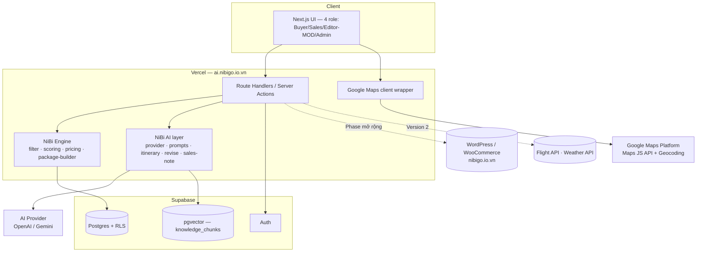
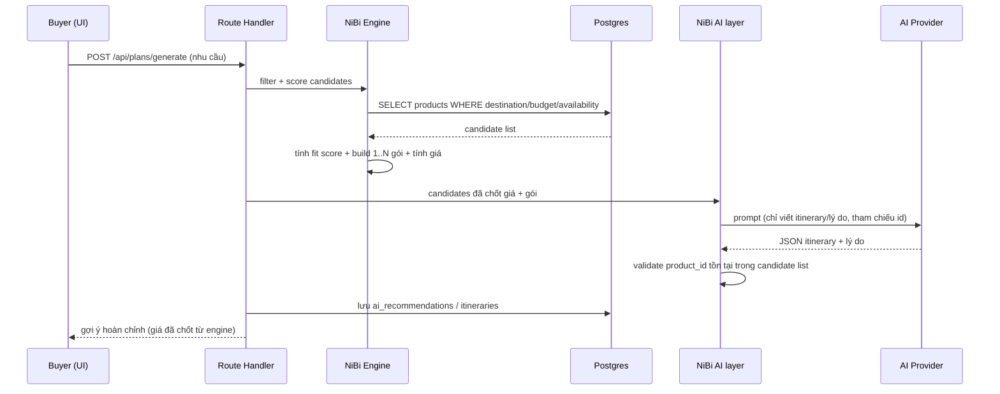
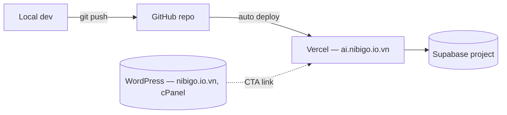

# System Architecture — NiBiGo AI Travel Platform

## 1. Kiến trúc tổng quan



> **Lưu ý domain:** app AI/commerce deploy tại `ai.nibigo.io.vn` (Vercel). Trang
> `nibigo.io.vn` (WordPress, cPanel) là website giới thiệu/blog hiện có, giữ nguyên, chỉ
> liên kết CTA sang `ai.nibigo.io.vn`.

## 2. Bảng phân vai trách nhiệm

| Thành phần | Vai trò | Không làm |
|---|---|---|
| **Route Handlers / Server Actions** | Auth check, validate input, gọi engine, gọi AI layer, ghi DB | Không tự tin dữ liệu từ client; không để UI tính giá |
| **NiBi Engine** (`lib/engine`) | Lọc sản phẩm theo điểm đến/ngân sách/availability, tính fit score, tính giá/cost breakdown, build candidate list, áp dụng revision | Không sinh ngôn ngữ, không gọi LLM |
| **NiBi AI layer** (`lib/ai`) | Sinh itinerary, lý do đề xuất, diễn giải phản hồi chỉnh sửa thành thao tác có cấu trúc, sales note | **Không tính giá, không bịa sản phẩm/vị trí/availability, không tự đổi trạng thái booking/order** |
| **Maps wrapper** (`lib/maps`) | Hiển thị bản đồ, marker vị trí sản phẩm, geocode khi Editor nhập địa chỉ | Không lưu trực tiếp xuống DB (qua route handler) |
| **Supabase Auth + RLS** | Xác thực, lưu role, chặn truy cập dữ liệu theo role ở tầng DB | Không là tầng phân quyền duy nhất (vẫn cần check ở middleware/route) |
| **Postgres** | Nguồn sự thật duy nhất cho sản phẩm/giá/availability/booking/order/role | — |
| **pgvector (`knowledge_chunks`)** | RAG ngữ cảnh chính sách/FAQ/bài viết cho NiBi AI | Không dùng để chọn sản phẩm chính (sản phẩm luôn qua SQL filter có cấu trúc) |

## 3. Cấu trúc thư mục

```text
src/
├── app/
│   ├── (public)/
│   │   ├── page.tsx                       # landing
│   │   ├── login/page.tsx
│   │   └── register/page.tsx
│   ├── auth/callback/route.ts
│   ├── auth/signout/route.ts
│   ├── (buyer)/
│   │   ├── buyer/dashboard/page.tsx
│   │   ├── buyer/explore/page.tsx
│   │   ├── buyer/products/[id]/page.tsx
│   │   ├── buyer/ai-planner/page.tsx
│   │   ├── buyer/ai-planner/results/[planId]/page.tsx
│   │   ├── buyer/cart/page.tsx
│   │   ├── buyer/booking-request/[id]/page.tsx
│   │   ├── buyer/orders/[id]/page.tsx
│   │   └── buyer/bookings/page.tsx
│   ├── (sales)/
│   │   ├── sales/dashboard/page.tsx
│   │   ├── sales/bookings/page.tsx
│   │   ├── sales/bookings/[id]/page.tsx
│   │   └── sales/orders/page.tsx
│   ├── (editor)/
│   │   ├── editor/dashboard/page.tsx
│   │   ├── editor/products/page.tsx
│   │   ├── editor/products/[id]/edit/page.tsx
│   │   └── editor/articles/page.tsx
│   ├── (admin)/
│   │   ├── admin/dashboard/page.tsx
│   │   ├── admin/users/page.tsx
│   │   ├── admin/approvals/page.tsx
│   │   ├── admin/bookings/page.tsx
│   │   ├── admin/orders/page.tsx
│   │   └── admin/audit-logs/page.tsx
│   └── api/
│       ├── products/route.ts
│       ├── products/[id]/route.ts
│       ├── articles/route.ts
│       ├── trip-requests/route.ts
│       ├── plans/generate/route.ts          # dựng gợi ý (filter+score+price → AI viết)
│       ├── plans/revise/route.ts            # chỉnh lịch trình NL
│       ├── cart/route.ts
│       ├── bookings/route.ts
│       ├── bookings/[id]/status/route.ts
│       ├── orders/route.ts
│       ├── orders/[id]/status/route.ts
│       └── admin/approvals/[id]/route.ts
│
├── components/
│   ├── ui/                                  # primitives (button, card, badge, modal...)
│   ├── product/                             # ProductCard, ProductDetail, MapMarkerList
│   ├── ai-planner/                          # TripRequestForm, ItineraryTimeline, CostBreakdown, ReviseBox
│   ├── booking/                             # BookingForm, StatusBadge, StatusHistory
│   ├── cart/
│   └── dashboard/                           # widgets riêng theo role
│
├── lib/
│   ├── supabase/                            # client.ts (browser) · server.ts (server) · admin.ts (service-role)
│   ├── ai/                                  # provider.ts · prompts.ts · itinerary.ts · revise.ts · sales-note.ts
│   ├── engine/                               # filter.ts · scoring.ts · pricing.ts · package-builder.ts · apply-revision.ts
│   ├── maps/                                 # client.ts · geocode.ts
│   ├── rag/                                  # retrieve.ts · embed.ts
│   ├── auth/                                 # getSession.ts · requireRole.ts
│   └── validation/                           # zod schemas theo từng entity
│
├── types/                                    # types sinh từ DATA_SCHEMA.md
└── integrations/                              # adapter rỗng cho tích hợp tương lai
    ├── woocommerce.ts                         # Phase mở rộng
    ├── payment.ts                             # Phase mở rộng — payment gateway thật
    ├── flight.ts                              # Version 2
    ├── weather.ts                             # Version 2
    └── zalo.ts                                # Phase mở rộng
```

## 4. API surface (route handlers chính)

| Method | Route | Vai trò | Quyền |
|---|---|---|---|
| GET | `/api/products` | List + filter sản phẩm | Public (chỉ `PUBLISHED`+`is_active`); Editor/Admin xem cả draft |
| POST | `/api/products` | Tạo sản phẩm | Editor/Admin |
| PATCH | `/api/products/[id]` | Sửa / đổi status | Editor (chính chủ) / Admin |
| GET/POST | `/api/articles` | List/tạo bài viết | Public GET; Editor/Admin POST |
| POST | `/api/trip-requests` | Lưu nhu cầu Buyer | Buyer |
| POST | `/api/plans/generate` | Engine lọc+score+giá → AI viết itinerary | Buyer (chính chủ request) |
| POST | `/api/plans/revise` | AI diễn giải → Engine áp dụng + tính lại giá | Buyer (chính chủ) |
| POST/PATCH | `/api/cart` | Thêm/sửa/xóa cart item | Buyer (chính chủ) |
| POST | `/api/bookings` | Tạo booking request + mã + AI sales note | Buyer |
| PATCH | `/api/bookings/[id]/status` | Đổi trạng thái booking | Sales/Admin |
| POST | `/api/orders` | Tạo order từ cart | Buyer |
| PATCH | `/api/orders/[id]/status` | Đổi trạng thái order | Sales/Admin |
| PATCH | `/api/admin/approvals/[id]` | Approve/reject sản phẩm/bài viết | Admin |

## 5. Sequence diagram — luồng AI Planner



## 6. Bảo mật

- **Key handling:** `SUPABASE_SERVICE_ROLE_KEY`, `OPENAI_API_KEY`/`GEMINI_API_KEY` chỉ dùng
  trong server code (route handler/server action), không bao giờ vào bundle client.
  `NEXT_PUBLIC_GOOGLE_MAPS_API_KEY` là key client-side nhưng **giới hạn theo HTTP referrer**
  và **API restriction** (chỉ Maps JS API + Geocoding) trên Google Cloud Console.
- **RLS:** bật trên mọi bảng chứa dữ liệu user-scoped (`trip_requests`, `bookings`, `orders`,
  `cart_items`, `ai_sessions`...). Helper `current_role()`/`is_admin()` dùng trong policy.
- **2-layer role check:** middleware chặn truy cập route theo nhóm `/buyer|/sales|/editor|/admin`
  (UX, redirect nhanh) **+** RLS/route handler chặn lại ở tầng dữ liệu (an toàn thật — không
  tin client).
- **Input validation:** zod schema cho mọi payload (trip request, booking, order, product, article).
- **LLM safety:** prompt ép buộc JSON schema cố định; AI **chỉ tham chiếu sản phẩm bằng `id`**
  có trong candidate list do backend cung cấp; route handler validate lại `id` trước khi lưu;
  nếu AI trả `id` không hợp lệ → loại bỏ, không hiển thị.
- **Rate/cost guard:** giới hạn số lần gọi AI/phiên/IP; cache theo trip request giống nhau
  trong thời gian ngắn để giảm chi phí token.
- **Audit log:** mọi thay đổi giá, role, approval, trạng thái booking/order ghi vào `audit_logs`.

## 7. Kế hoạch triển khai (deployment)



- App build/deploy tự động qua Vercel khi push lên branch chính.
- Domain `ai.nibigo.io.vn` trỏ CNAME tới Vercel; `nibigo.io.vn` giữ nguyên trên cPanel.
- Biến môi trường khai báo trong Vercel Project Settings (không commit `.env.local`).

## 8. Điểm mở rộng tương lai (extension points)

| Tích hợp | Vị trí chuẩn bị | Khi nào |
|---|---|---|
| Payment gateway thật (VNPay/Momo/Stripe...) | `src/integrations/payment.ts` | Phase mở rộng |
| WooCommerce order / đồng bộ sản phẩm | `src/integrations/woocommerce.ts` | Phase mở rộng |
| Zalo OA / ZNS / Mini App | `src/integrations/zalo.ts` | Phase mở rộng |
| **Flight booking API** | `src/integrations/flight.ts` | **Version 2** |
| **Weather API** | `src/integrations/weather.ts` | **Version 2** |
| Đa điểm đến ngoài Ninh Bình | mở rộng bảng `destinations` + filter engine | Phase tương lai |
| Đồng bộ user WordPress | mở rộng `profiles` + webhook WP | Phase mở rộng |

## 9. Design tokens

```css
--brand-green: #1F6F4C;   /* màu chính — thiên nhiên Ninh Bình */
--brand-gold:  #D9A441;   /* màu nhấn — ấm, premium */
--brand-cream: #FBF6EC;
--brand-ink:   #1A1A1A;

--status-new: #94A3B8;
--status-contacted: #60A5FA;
--status-checking: #FBBF24;
--status-waiting-payment: #F97316;
--status-confirmed: #22C55E;
--status-completed: #15803D;
--status-cancelled: #94A3B8;

--status-draft: #94A3B8;
--status-pending-review: #FBBF24;
--status-published: #22C55E;
--status-archived: #64748B;
--status-rejected: #EF4444;
```

Component list tối thiểu: `Button`, `Card`, `Badge` (status), `Modal`, `Tabs`, `Table`,
`MapView`/`MapMarker`, `ItineraryTimeline`, `CostBreakdownTable`, `ProductCard`,
`StatusHistoryList`, `EmptyState`, `LoadingSpinner`.
