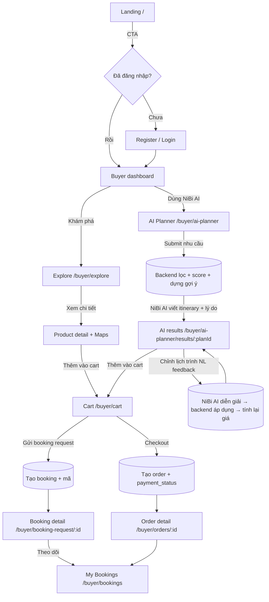
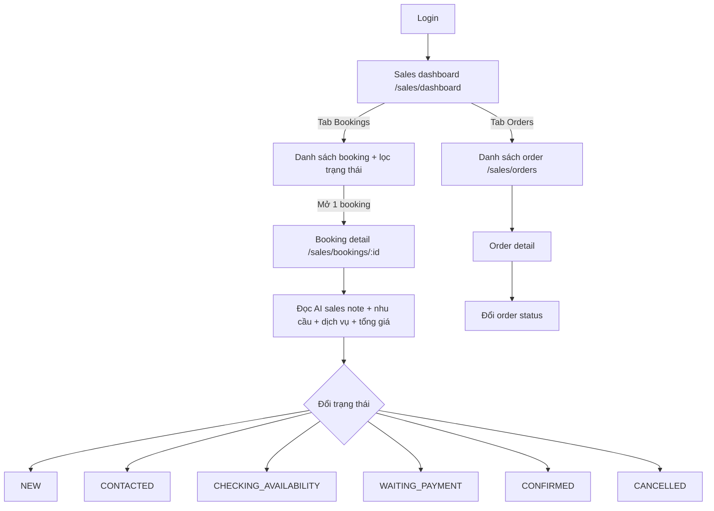
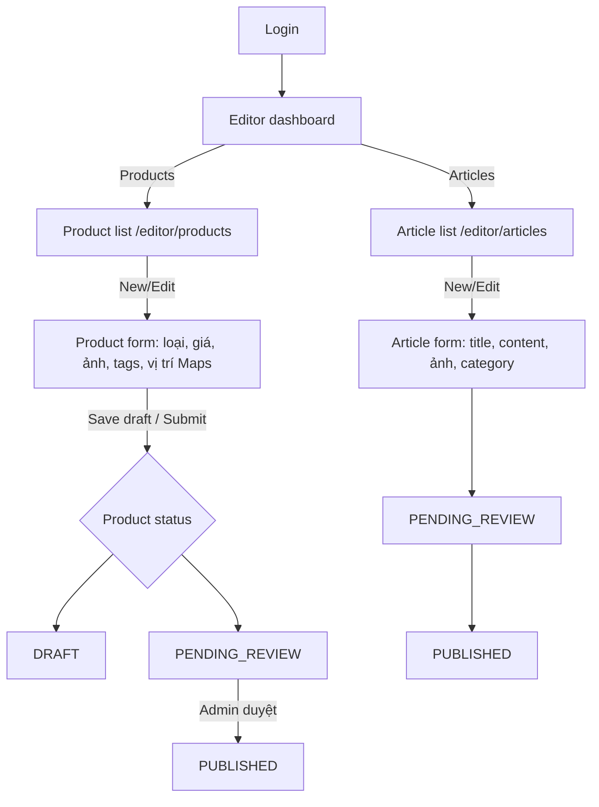
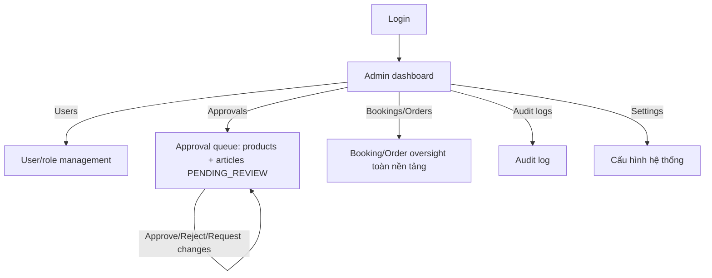
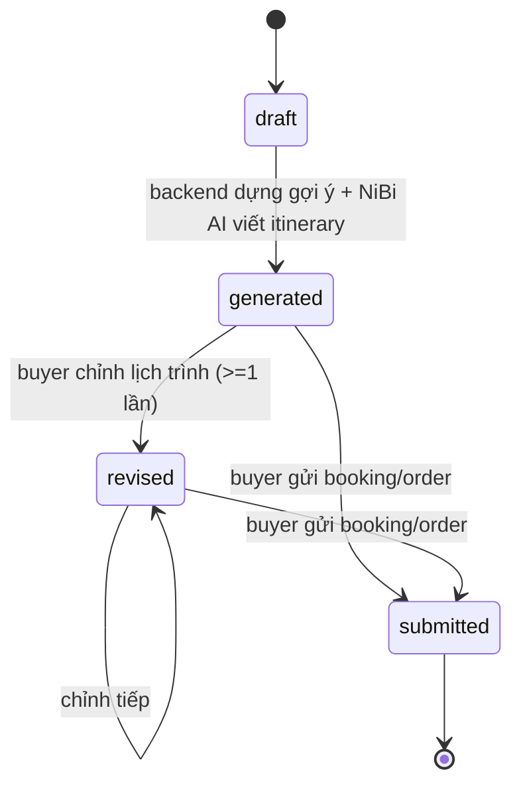
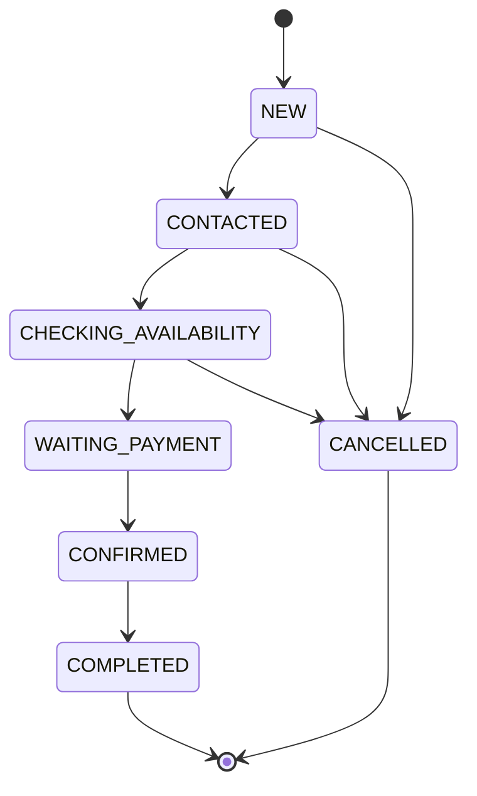
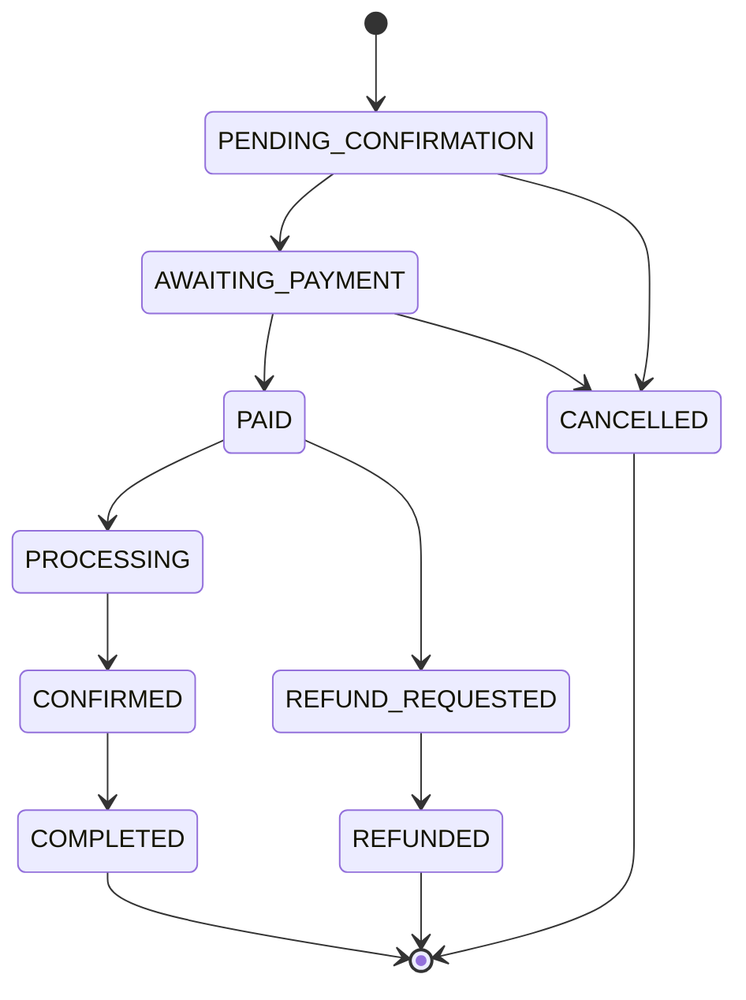
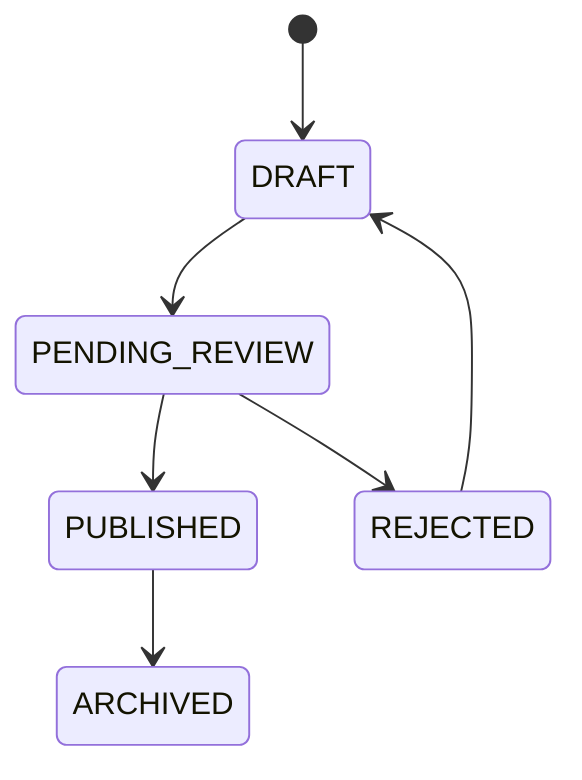

# User Flow — NiBiGo AI Travel Platform

Sitemap 4 role, luồng chính từng role, và state machine cho booking/order.

> Chi tiết UI từng màn hình (entry/exit point, component, acceptance criteria): [docs/ui-ux/](ui-ux/).

---

## 1. Sitemap tổng quan

```text
/
├── /login
├── /register
├── /buyer
│   ├── /buyer/dashboard
│   ├── /buyer/explore                       # danh mục dịch vụ + filter + Maps
│   ├── /buyer/products/:id                  # chi tiết sản phẩm
│   ├── /buyer/ai-planner                    # trip request form (NiBi AI)
│   ├── /buyer/ai-planner/results/:planId    # gợi ý cá nhân hóa + itinerary + cost breakdown
│   ├── /buyer/cart
│   ├── /buyer/booking-request/:id
│   ├── /buyer/orders/:id
│   └── /buyer/bookings                      # My Bookings / My Orders
│
├── /sales
│   ├── /sales/dashboard
│   ├── /sales/bookings
│   ├── /sales/bookings/:id
│   ├── /sales/orders
│   └── /sales/notes
│
├── /editor
│   ├── /editor/dashboard
│   ├── /editor/products
│   ├── /editor/products/new
│   ├── /editor/products/:id/edit
│   ├── /editor/articles
│   ├── /editor/articles/new
│   └── /editor/articles/:id/edit
│
└── /admin
    ├── /admin/dashboard
    ├── /admin/users
    ├── /admin/roles
    ├── /admin/approvals
    ├── /admin/products
    ├── /admin/bookings
    ├── /admin/orders
    ├── /admin/settings
    └── /admin/audit-logs
```

## 2. Luồng Buyer (happy path)



### Bước chi tiết
1. **Landing** → CTA → nếu chưa đăng nhập thì vào **Register/Login**; role mặc định khi đăng ký là `buyer`.
2. **Explore**: xem danh mục tour/homestay/hotel/restaurant/transport/combo/bài viết, filter theo giá/tag/availability. **Product detail** hiển thị Google Maps vị trí.
3. **AI Planner**: nhập nhu cầu (hoặc bằng ngôn ngữ tự nhiên). Backend lọc sản phẩm theo `destination` + `availability` + ngân sách → tính fit score → dựng gợi ý → **tính tổng giá từ DB**.
4. NiBi AI nhận gợi ý đã chốt sản phẩm → sinh tên/tóm tắt, lý do, itinerary từng ngày.
5. **AI results**: itinerary timeline, cost breakdown, lý do đề xuất, danh sách sản phẩm, điều kiện cần xác nhận, **ô chỉnh lịch trình** (chat 1 dòng).
6. **Chỉnh lịch trình**: nhập "bỏ Hang Múa, thêm hoạt động nhẹ" → NiBi AI → thao tác có cấu trúc → backend áp dụng + tính lại giá → cập nhật cùng màn.
7. **Cart**: thêm dịch vụ từ product detail hoặc từ gợi ý AI; xem tổng tiền + platform fee nếu có.
8. **Gửi booking request** (dịch vụ cần xác nhận) hoặc **checkout tạo order** (commerce flow) → mã booking/order + `payment_status` mặc định `unpaid`/`pending`.
9. Theo dõi trạng thái ở **My Bookings/Orders**.

## 3. Luồng Sales



### Bước chi tiết
1. **Login** (chỉ role `sales` mới vào được `/sales/*`).
2. **Dashboard**: tổng quan lead mới + booking/order cần xử lý.
3. **Booking detail**: nhu cầu khách, dịch vụ/lịch trình đã chọn (itinerary + cost breakdown), tổng chi phí, **AI sales note**.
4. **Đổi trạng thái booking**: theo state machine §4.2; mỗi lần đổi ghi `booking_status_logs`.
5. **Order detail**: kiểm tra order items, `payment_status`, đổi `order_status` theo state machine §4.3.

## 4. Luồng Editor/MOD



### Bước chi tiết
1. **Login** (role `editor`).
2. **Product form**: nhập đủ field bắt buộc (tên, loại, giá, đơn vị giá, mô tả, ảnh, tags, suitable_for, **lat/lng/address**, availability_status).
3. Lưu **DRAFT** hoặc gửi **PENDING_REVIEW**; Admin duyệt → **PUBLISHED** (chỉ sản phẩm `PUBLISHED` + `is_active` hiển thị cho Buyer / được NiBi AI đề xuất).
4. **Article form**: title, slug, excerpt, content, cover image, category, tags, sản phẩm liên quan; cùng pipeline duyệt.

## 5. Luồng Admin



### Bước chi tiết
1. **Login** (role `admin`, full access).
2. **User management**: gán/gỡ 4 role, khóa/mở khóa user (không xóa user có booking/order).
3. **Approval queue**: duyệt sản phẩm/bài viết `PENDING_REVIEW`.
4. **Booking/Order oversight**: lọc theo ngày/Sales phụ trách/payment status/giá trị; can thiệp khi cần (ghi audit log).
5. **Audit logs**: theo dõi mọi thay đổi quan trọng (giá, role, approval, trạng thái).

## 6. State machine

### 6.1 Trip request (`trip_requests.status`)


### 6.2 Booking request (`booking_requests.status`)


Quy tắc: chỉ **Sales/Admin** đổi trạng thái booking. Buyer chỉ **xem**. Mỗi lần đổi ghi một dòng
`booking_status_logs` (ai đổi, từ trạng thái nào sang trạng thái nào, lúc nào).

### 6.3 Order (`orders.status`)


### 6.4 Product / Article status


## 7. Edge cases & empty states

| Tình huống | Xử lý |
|---|---|
| Ngân sách quá thấp so với giá tối thiểu | Vẫn dựng gợi ý rẻ nhất có thể + cảnh báo "Ngân sách thấp hơn mức khả thi, đây là gợi ý tối ưu nhất" |
| Thiếu thông tin quan trọng (vd chưa có số người) | NiBi AI hỏi thêm trước khi sinh gợi ý — không hỏi quá nhiều câu |
| LLM lỗi / JSON sai | Fallback: hiển thị gợi ý từ backend (có giá + sản phẩm) + itinerary tối giản tự sinh từ template, báo nhẹ |
| Sản phẩm `sold_out` | Loại khỏi candidate; không cho tạo booking/order; nếu khách muốn giữ khi chỉnh lịch trình → báo "hết chỗ, gợi ý thay thế" |
| Sản phẩm `limited` | Cho tiếp tục nhưng hiển thị cảnh báo rõ |
| Sản phẩm `need_confirmation` | Chỉ cho request-to-book, không cho instant order |
| Buyer chưa có trip request/booking/order nào | Empty state ở dashboard + CTA khám phá/dùng AI |
| Sales/Editor/Admin chưa có dữ liệu | Empty state tương ứng + CTA tiếp theo |
| Chỉnh lịch trình làm vượt ngân sách | Cho phép nhưng badge cảnh báo "vượt ngân sách ~X%" |
| Role không có quyền truy cập route | Trang 403 hoặc redirect về dashboard đúng role |

## 8. Điều hướng & bảo vệ route

- Public: `/`, `/login`, `/register`.
- Buyer (đăng nhập, role=buyer): `/buyer/*`.
- Sales (role=sales): `/sales/*`.
- Editor/MOD (role=editor): `/editor/*`.
- Admin (role=admin): `/admin/*` (full access, có thể xem cả các khu vực vận hành khác để giám sát).
- Truy cập nhóm route không đúng role → redirect về dashboard của role hiện tại hoặc trang 403.
- Chưa đăng nhập truy cập route cần auth → redirect `/login?next=...`.
- Middleware kiểm tra session (Supabase) + role trước khi vào nhóm route tương ứng; route handler/RLS kiểm tra lại (không tin client).

## 9. Bản đồ tương tác AI trong luồng

| Điểm chạm | Ai làm | Output |
|---|---|---|
| Submit AI Planner form | Backend (filter + score + build) → NiBi AI (viết) | Gợi ý có itinerary + lý do |
| Nút "Chỉnh lịch trình" | NiBi AI (parse intent) → Backend (apply + reprice) → NiBi AI (viết lại) | Gợi ý cập nhật + giá mới |
| Gửi booking/order | Backend (tạo booking/order) → NiBi AI (sales note) | Mã booking/order + AI sales note (lưu cho Sales) |
| Sales mở booking | (đọc dữ liệu đã lưu) | Hiển thị note đã sinh sẵn |

> Chi tiết prompt và phân vai: [AI_DESIGN.md](AI_DESIGN.md).
