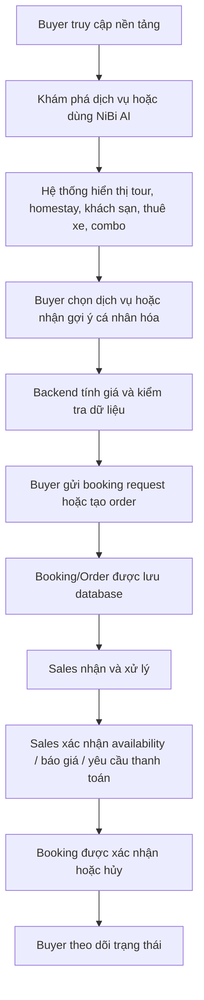
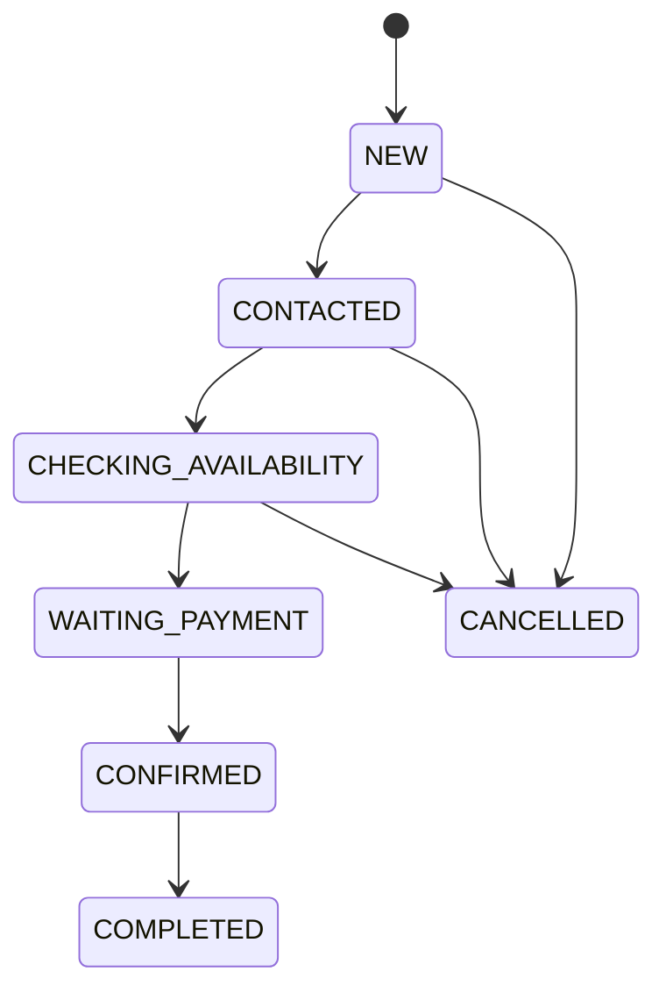
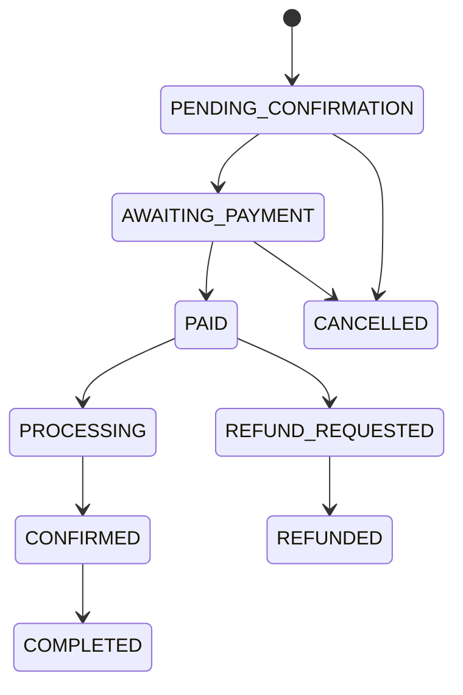
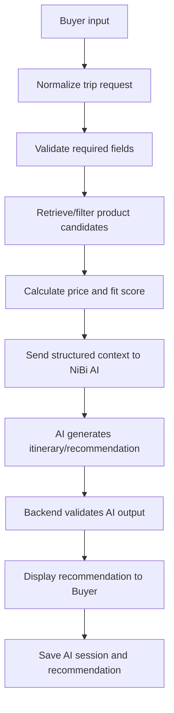

# 04. Business Process Workflow — NiBiGo AI Travel Platform

**Project name:** NiBiGo AI Travel Platform
**AI assistant name:** NiBi AI
**Document type:** Business Process & Workflow Specification
**Version:** v1.0
**Status:** Draft
**Owner:** Đặng Trần Đạt
**Last updated:** 2026-06-22

---

## 1. Document Purpose

Tài liệu này mô tả các quy trình nghiệp vụ chính của NiBiGo AI Travel Platform.

Mục tiêu của tài liệu là làm rõ:

* Các luồng nghiệp vụ chính trong nền tảng.
* Cách Buyer, NiBi AI, Sales, Editor/MOD và Admin tương tác với nhau.
* Dữ liệu nào được tạo ra ở từng bước.
* Trạng thái nào thay đổi trong quá trình booking/order.
* Điểm nào do AI xử lý, điểm nào do backend xử lý, điểm nào cần human-in-the-loop.
* Cách hệ thống mở rộng từ MVP sang commerce thật, payment thật và Zalo integration trong tương lai.

Tài liệu này là cầu nối giữa yêu cầu kinh doanh và thiết kế chức năng. Nó giúp đảm bảo sản phẩm không chỉ có giao diện đẹp, mà có luồng vận hành logic, có trạng thái dữ liệu rõ ràng và có thể mở rộng.

---

## 2. Process Design Principles

Các workflow của NiBiGo được thiết kế theo các nguyên tắc sau:

### 2.1 Buyer-first, Operation-aware

Trải nghiệm Buyer phải đơn giản, dễ hiểu và ít ma sát. Tuy nhiên, phía sau vẫn cần có quy trình vận hành đủ rõ để Sales/Admin xử lý booking thật.

### 2.2 AI Suggests, System Verifies

NiBi AI được dùng để hiểu nhu cầu, gợi ý dịch vụ, tạo lịch trình, giải thích đề xuất và tạo sales note.

Tuy nhiên:

* Giá cuối cùng do backend/database tính.
* Availability do database hoặc Sales xác nhận.
* Booking/order phải được lưu vào database.
* Payment status không do AI tự quyết định.
* AI không được tự cam kết dịch vụ đã được đặt nếu chưa có trạng thái hợp lệ trong hệ thống.

### 2.3 Human-in-the-loop for Travel Booking

Du lịch có nhiều ngoại lệ như hết phòng, đổi giờ xe, thay đổi lịch trình, đối tác phản hồi chậm, thời tiết hoặc yêu cầu đặc biệt. Vì vậy, Sales giữ vai trò xác nhận và xử lý ngoại lệ trong giai đoạn đầu.

### 2.4 Transparent State Management

Mọi booking/order cần có trạng thái rõ ràng. Buyer, Sales và Admin phải hiểu booking đang ở bước nào.

### 2.5 Scalable Workflow

MVP có thể bắt đầu với request-to-book và payment status demo/manual, nhưng cấu trúc workflow cần sẵn sàng mở rộng sang payment thật, Zalo OA, Zalo Mini App và partner portal sau này.

---

## 3. Main Actors

### 3.1 BUYER

Buyer là khách hàng cuối, sử dụng nền tảng để tìm kiếm, nhận tư vấn, chọn dịch vụ và gửi booking request/order.

### 3.2 NiBi AI

NiBi AI là trợ lý AI cá nhân hóa, hỗ trợ Buyer trong quá trình ra quyết định và hỗ trợ Sales bằng lead summary/sales note.

### 3.3 SALES

Sales xử lý booking request/order, xác nhận availability, liên hệ khách, gửi báo giá/payment request và cập nhật trạng thái booking.

### 3.4 EDITOR/MOD

Editor/MOD quản lý dữ liệu sản phẩm và nội dung như tour, homestay, khách sạn, thuê xe, combo, trải nghiệm và bài viết.

### 3.5 ADMIN

Admin quản trị toàn hệ thống, bao gồm user, role, sản phẩm, nội dung, booking/order, payment status, cấu hình hệ thống và logs.

### 3.6 External Services

Các dịch vụ bên ngoài có thể gồm:

* Google Maps Platform.
* AI Provider như OpenAI hoặc Gemini.
* Payment Gateway ở phase sau.
* Zalo OA/ZNS/Zalo Mini App ở phase sau.
* WordPress/WooCommerce ở phase sau nếu cần tích hợp.

---

## 4. High-level Platform Workflow

Ở cấp độ tổng thể, NiBiGo vận hành theo luồng sau:

Luồng này thể hiện bản chất sản phẩm:

* Buyer không chỉ hỏi AI.
* Buyer có thể chọn dịch vụ thật.
* Hệ thống có lưu dữ liệu thật.
* Sales/Admin có dashboard vận hành.
* Booking có trạng thái rõ ràng.

---

# PART A — BUYER WORKFLOWS

---

## 5. Buyer Registration & Login Workflow

### 5.1 Objective

Cho phép Buyer tạo tài khoản, đăng nhập và sử dụng các chức năng cá nhân hóa như NiBi AI, booking request, order tracking và saved services.

### 5.2 Trigger

Buyer muốn sử dụng nền tảng hoặc gửi booking request/order.

### 5.3 Main Flow

1. Buyer truy cập web app.
2. Buyer chọn Register hoặc Login.
3. Buyer nhập email, mật khẩu và thông tin cơ bản.
4. Hệ thống xác thực thông tin.
5. Hệ thống tạo user với role mặc định là `BUYER`.
6. Buyer được chuyển đến Buyer Dashboard hoặc trang đang xem trước đó.
7. Buyer có thể tiếp tục khám phá dịch vụ, dùng NiBi AI hoặc tạo booking.

### 5.4 Alternative Flow

Nếu Buyer đã có tài khoản:

1. Buyer chọn Login.
2. Buyer nhập email/mật khẩu.
3. Hệ thống xác thực.
4. Buyer đăng nhập thành công.

### 5.5 Exception Flow

Nếu thông tin đăng nhập sai:

1. Hệ thống hiển thị lỗi.
2. Buyer có thể nhập lại hoặc reset password.

Nếu email đã tồn tại:

1. Hệ thống thông báo tài khoản đã tồn tại.
2. Buyer được gợi ý đăng nhập.

### 5.6 Data Created / Updated

* `users`
* `user_profiles`
* `user_roles`

### 5.7 Output

Buyer có tài khoản hợp lệ và có thể sử dụng các tính năng cá nhân hóa.

---

## 6. Buyer Product Discovery Workflow

### 6.1 Objective

Cho phép Buyer khám phá các dịch vụ du lịch Ninh Bình trước khi dùng AI hoặc đặt dịch vụ.

### 6.2 Trigger

Buyer truy cập nền tảng và muốn xem dịch vụ.

### 6.3 Main Flow

1. Buyer vào trang chủ hoặc trang danh mục.
2. Hệ thống hiển thị các nhóm dịch vụ:

   * Tour.
   * Homestay.
   * Khách sạn.
   * Thuê xe.
   * Trải nghiệm.
   * Combo.
   * Bài viết/guide.
3. Buyer chọn một danh mục.
4. Hệ thống hiển thị danh sách sản phẩm active.
5. Buyer lọc theo giá, tag, nhóm phù hợp, destination hoặc availability.
6. Buyer chọn một sản phẩm.
7. Hệ thống mở trang chi tiết sản phẩm.
8. Buyer xem ảnh, mô tả, giá, vị trí, tag, chính sách và availability.
9. Buyer có thể:

   * Lưu sản phẩm.
   * Thêm vào cart/selected services.
   * Hỏi NiBi AI về sản phẩm.
   * Gửi booking request.
   * Xem sản phẩm liên quan.

### 6.4 Data Read

* `products`
* `product_categories`
* `product_images`
* `product_locations`
* `product_availability`
* `articles`

### 6.5 Data Created / Updated

Có thể cập nhật:

* `saved_products`
* `recently_viewed_products`
* `cart_items`

### 6.6 Output

Buyer có thể hiểu các lựa chọn dịch vụ trước khi ra quyết định.

---

## 7. Buyer NiBi AI Planning Workflow

### 7.1 Objective

Cho phép Buyer nhập nhu cầu chuyến đi và nhận gợi ý cá nhân hóa từ NiBi AI.

### 7.2 Trigger

Buyer mở NiBi AI hoặc chọn “Tạo lịch trình với NiBi AI”.

### 7.3 Required Buyer Input

Buyer có thể nhập:

* Điểm đến.
* Số ngày.
* Ngày đi.
* Số người.
* Ngân sách.
* Phong cách du lịch.
* Sở thích.
* Yêu cầu đặc biệt.
* Điểm đón nếu cần thuê xe.
* Nhu cầu lưu trú nếu có.
* Nhu cầu thuê xe nếu có.

### 7.4 Main Flow

1. Buyer mở NiBi AI.
2. Buyer nhập nhu cầu chuyến đi bằng form hoặc ngôn ngữ tự nhiên.
3. Backend chuẩn hóa input thành `trip_request`.
4. Hệ thống kiểm tra thông tin bắt buộc.
5. Nếu thiếu thông tin quan trọng, NiBi AI hỏi lại.
6. Backend lọc sản phẩm ứng viên từ database.
7. Backend loại bỏ sản phẩm inactive hoặc sold out.
8. Backend tính toán giá sơ bộ và fit score.
9. NiBi AI nhận danh sách sản phẩm hợp lệ, business rules và nhu cầu Buyer.
10. NiBi AI tạo recommendation/itinerary.
11. Backend validate output của AI.
12. Hệ thống hiển thị gợi ý cho Buyer.
13. Buyer có thể chọn một đề xuất, chỉnh sửa hoặc gửi booking request.

### 7.5 AI Responsibilities

NiBi AI xử lý:

* Hiểu nhu cầu.
* Hỏi lại nếu thiếu thông tin.
* Tạo lịch trình dễ hiểu.
* Giải thích lý do đề xuất.
* Cảnh báo điểm cần xác nhận.
* Đề xuất cách chỉnh nếu vượt ngân sách.
* Viết summary cho Sales.

### 7.6 Backend Responsibilities

Backend xử lý:

* Lưu trip request.
* Lọc sản phẩm.
* Kiểm tra availability.
* Tính giá.
* Tính fit score.
* Validate output AI.
* Lưu recommendation nếu cần.
* Không cho AI bịa sản phẩm/giá.

### 7.7 Exception Flow

Nếu không có sản phẩm phù hợp:

1. Hệ thống thông báo không tìm thấy gói phù hợp hoàn toàn.
2. NiBi AI đề xuất điều chỉnh:

   * Tăng ngân sách.
   * Giảm số điểm đi.
   * Đổi loại lưu trú.
   * Chọn xe ghép thay vì xe riêng.
3. Buyer có thể cập nhật nhu cầu.

Nếu AI lỗi:

1. Hệ thống hiển thị fallback message.
2. Buyer có thể thử lại.
3. Lỗi được ghi vào log.

### 7.8 Data Created / Updated

* `trip_requests`
* `ai_sessions`
* `ai_messages`
* `ai_recommendations`
* `itineraries`
* `itinerary_items`

### 7.9 Output

Buyer nhận được gợi ý cá nhân hóa gồm:

* Dịch vụ đề xuất.
* Lịch trình.
* Cost breakdown.
* Fit score nếu có.
* Lý do đề xuất.
* Cảnh báo cần xác nhận.

---

## 8. Buyer Itinerary Refinement Workflow

### 8.1 Objective

Cho phép Buyer chỉnh lịch trình hoặc gói dịch vụ bằng ngôn ngữ tự nhiên.

### 8.2 Trigger

Buyer đã nhận được recommendation/itinerary và muốn chỉnh sửa.

Ví dụ:

* “Giảm ngân sách một chút.”
* “Lịch nhẹ hơn.”
* “Thêm hoạt động cho trẻ em.”
* “Bỏ Hang Múa vì không muốn leo.”
* “Đổi sang khách sạn đẹp hơn.”
* “Ưu tiên xe riêng.”

### 8.3 Main Flow

1. Buyer nhập yêu cầu chỉnh sửa.
2. Hệ thống xác định recommendation/itinerary hiện tại.
3. NiBi AI phân tích yêu cầu chỉnh sửa.
4. Backend kiểm tra lại sản phẩm phù hợp.
5. Backend tính lại giá nếu thay đổi dịch vụ.
6. NiBi AI viết lại lịch trình và lý do thay đổi.
7. Backend validate output.
8. Hệ thống hiển thị phiên bản mới cho Buyer.
9. Buyer có thể tiếp tục chỉnh hoặc gửi booking request/order.

### 8.4 Backend Validation

Backend cần đảm bảo:

* Dịch vụ mới có trong database.
* Giá được tính lại từ database.
* Dịch vụ inactive/sold out không được đưa vào.
* Tổng chi phí hiển thị đúng.
* Lịch trình không chứa sản phẩm bị loại.

### 8.5 Data Created / Updated

* `ai_messages`
* `ai_recommendations`
* `itineraries`
* `itinerary_items`
* `recommendation_versions` nếu có

### 8.6 Output

Buyer nhận được phiên bản lịch trình/gói dịch vụ được điều chỉnh.

---

## 9. Buyer Booking Request Workflow

### 9.1 Objective

Cho phép Buyer gửi yêu cầu đặt dịch vụ dựa trên sản phẩm, combo hoặc itinerary đã chọn.

### 9.2 Trigger

Buyer bấm “Gửi yêu cầu đặt dịch vụ” hoặc “Đặt combo này”.

### 9.3 Main Flow

1. Buyer chọn dịch vụ/combo/itinerary.
2. Buyer kiểm tra cost breakdown.
3. Buyer nhập thông tin bổ sung:

   * Họ tên.
   * Số điện thoại.
   * Email nếu cần.
   * Ngày đi.
   * Số người.
   * Điểm đón.
   * Ghi chú đặc biệt.
4. Hệ thống validate thông tin.
5. Backend tạo booking request.
6. Backend tạo mã booking.
7. Booking status mặc định là `NEW`.
8. Payment status mặc định là `UNPAID` hoặc `NOT_REQUIRED_YET`.
9. Hệ thống hiển thị màn hình xác nhận.
10. Sales nhận booking request trong dashboard.

### 9.4 Booking Code Format

Mã booking theo format đã chốt (khớp `next_booking_code()` trong DATA_SCHEMA.md):

`NBG-YYYY-NNNN`

Ví dụ:

`NBG-2026-0001`

### 9.5 Data Created / Updated

* `booking_requests`
* `booking_items`
* `booking_status_logs`
* `sales_notes`
* `notification_events` nếu có notification layer
* `ai_recommendations` liên kết với booking nếu booking đến từ NiBi AI

### 9.6 Output

Buyer nhận được:

* Mã booking.
* Trạng thái booking.
* Tổng chi phí dự kiến.
* Thông báo rằng dịch vụ cần Sales/Admin xác nhận nếu chưa instant booking.
* Hướng dẫn bước tiếp theo.

### 9.7 Business Rules

* Booking request phải được lưu database.
* Không hiển thị “đặt thành công hoàn toàn” nếu chưa được xác nhận.
* Nếu dịch vụ cần xác nhận, trạng thái phải thể hiện rõ.
* Nếu dịch vụ sold out, không cho tạo booking.
* Nếu dịch vụ limited, cho tạo request nhưng hiển thị cảnh báo.

---

## 10. Buyer Order / Commerce Workflow

### 10.1 Objective

Cho phép Buyer tạo order ở mức MVP cho các dịch vụ đã chọn.

### 10.2 Trigger

Buyer chọn “Checkout” hoặc “Tạo order”.

### 10.3 Main Flow

1. Buyer thêm dịch vụ vào cart/selected services.
2. Hệ thống hiển thị cart.
3. Buyer kiểm tra:

   * Dịch vụ.
   * Số lượng.
   * Ngày sử dụng.
   * Giá từng dịch vụ.
   * Tổng tiền.
   * Platform fee nếu có.
4. Buyer nhập thông tin liên hệ.
5. Buyer xác nhận tạo order.
6. Backend tạo order.
7. Backend tạo order items.
8. Payment status mặc định là `UNPAID`, `PENDING` hoặc `PAID_DEMO`.
9. Order status mặc định là `PENDING_CONFIRMATION`.
10. Sales/Admin nhận order để xử lý.

### 10.4 Payment in MVP

MVP có thể dùng một trong ba cách:

* Manual payment status.
* Sandbox payment.
* Demo payment button.

Mục tiêu MVP là chứng minh commerce flow, chưa bắt buộc production payment gateway.

### 10.5 Data Created / Updated

* `carts`
* `cart_items`
* `orders`
* `order_items`
* `payments`
* `order_status_logs`

### 10.6 Output

Buyer nhận được:

* Mã order.
* Tổng tiền.
* Payment status.
* Order status.
* Hướng dẫn tiếp theo.

---

## 11. Buyer Booking/Order Tracking Workflow

### 11.1 Objective

Cho phép Buyer xem trạng thái booking/order sau khi đã gửi yêu cầu hoặc tạo order.

### 11.2 Trigger

Buyer vào trang “My Bookings” hoặc “My Orders”.

### 11.3 Main Flow

1. Buyer đăng nhập.
2. Buyer mở trang My Bookings/My Orders.
3. Hệ thống hiển thị danh sách booking/order của Buyer.
4. Buyer chọn một booking/order.
5. Hệ thống hiển thị:

   * Mã booking/order.
   * Danh sách dịch vụ.
   * Ngày đi.
   * Tổng chi phí.
   * Booking/order status.
   * Payment status.
   * Lịch sử trạng thái.
   * Ghi chú hoặc hướng dẫn từ Sales nếu có.
6. Buyer có thể gửi yêu cầu hỗ trợ hoặc xem chi tiết lịch trình.

### 11.4 Data Read

* `booking_requests`
* `booking_items`
* `orders`
* `order_items`
* `payments`
* `booking_status_logs`
* `order_status_logs`

### 11.5 Business Rules

* Buyer chỉ được xem booking/order của chính mình.
* Buyer không được sửa trạng thái booking/order.
* Nếu booking bị hủy, cần hiển thị lý do nếu có.
* Nếu cần thanh toán, hiển thị hướng dẫn rõ ràng.

---

# PART B — SALES WORKFLOWS

---

## 12. Sales Booking Handling Workflow

### 12.1 Objective

Cho phép Sales xử lý booking request từ Buyer.

### 12.2 Trigger

Có booking request mới được tạo.

### 12.3 Main Flow

1. Sales đăng nhập dashboard.
2. Sales mở danh sách booking request.
3. Sales lọc trạng thái `NEW`.
4. Sales mở booking detail.
5. Sales xem:

   * Thông tin Buyer.
   * Nhu cầu chuyến đi.
   * Dịch vụ được chọn.
   * Lịch trình AI đề xuất nếu có.
   * Cost breakdown.
   * AI sales note.
   * Ghi chú khách.
6. Sales liên hệ khách nếu cần.
7. Sales xác nhận availability với đối tác.
8. Sales cập nhật trạng thái booking.
9. Sales ghi chú quá trình xử lý.
10. Buyer thấy trạng thái mới trong trang My Bookings.

### 12.4 Sales Status Flow

Trạng thái đề xuất cho MVP:

### 12.5 Data Created / Updated

* `booking_requests`
* `booking_status_logs`
* `sales_notes`
* `internal_notes`

### 12.6 Output

Booking được cập nhật trạng thái và có lịch sử xử lý rõ ràng.

---

## 13. Sales Order Handling Workflow

### 13.1 Objective

Cho phép Sales xử lý order được tạo từ commerce flow.

### 13.2 Trigger

Có order mới được tạo.

### 13.3 Main Flow

1. Sales mở Order Dashboard.
2. Sales xem order mới.
3. Sales kiểm tra:

   * Buyer.
   * Order items.
   * Ngày sử dụng dịch vụ.
   * Tổng tiền.
   * Payment status.
   * Order status.
4. Sales xác nhận availability nếu cần.
5. Sales cập nhật order status.
6. Nếu cần thanh toán, Sales gửi hướng dẫn hoặc payment request.
7. Nếu đã thanh toán/cọc, Sales cập nhật trạng thái xác nhận.
8. Buyer theo dõi trạng thái trong My Orders.

### 13.4 Order Status Flow

Trạng thái đề xuất:

### 13.5 Data Created / Updated

* `orders`
* `order_items`
* `payments`
* `order_status_logs`
* `sales_notes`

### 13.6 Output

Order có trạng thái rõ ràng và Buyer được cập nhật.

---

## 14. Sales AI Note Workflow

### 14.1 Objective

Giúp Sales hiểu nhanh nhu cầu khách và cách tư vấn.

### 14.2 Trigger

Booking request/order được tạo từ NiBi AI hoặc có đủ thông tin nhu cầu.

### 14.3 Main Flow

1. Backend lấy thông tin trip request, selected services và Buyer notes.
2. NiBi AI tạo sales note.
3. Sales note được lưu vào booking/order.
4. Sales mở booking detail và đọc sales note.
5. Sales dùng note để tư vấn khách.

### 14.4 Sales Note Content

AI sales note nên gồm:

* Tóm tắt nhu cầu khách.
* Nhóm khách: gia đình, cặp đôi, nhóm bạn, budget, premium.
* Ngân sách.
* Ngày đi.
* Số người.
* Sản phẩm khách quan tâm.
* Điểm cần xác nhận.
* Gợi ý cách tư vấn.
* Cảnh báo rủi ro nếu có.

### 14.5 Example Output

“Khách là gia đình 4 người, có trẻ nhỏ, đi 2 ngày 1 đêm từ Hà Nội, ngân sách khoảng 6 triệu. Nên ưu tiên lịch trình nhẹ, xe riêng 7 chỗ và homestay gia đình gần Tràng An. Cần xác nhận ngày đi, điểm đón và tình trạng phòng. Khi tư vấn nên nhấn mạnh chi phí rõ ràng, lịch trình không quá mệt và có hỗ trợ xác nhận trước chuyến đi.”

---

# PART C — EDITOR/MOD WORKFLOWS

---

## 15. Product Creation Workflow

### 15.1 Objective

Cho phép Editor/MOD tạo sản phẩm du lịch mới.

### 15.2 Trigger

Editor/MOD muốn thêm tour, homestay, khách sạn, thuê xe, trải nghiệm hoặc combo.

### 15.3 Main Flow

1. Editor/MOD đăng nhập dashboard.
2. Editor/MOD chọn “Create Product”.
3. Editor/MOD chọn product type.
4. Hệ thống hiển thị form phù hợp.
5. Editor/MOD nhập:

   * Tên sản phẩm.
   * Mô tả.
   * Giá.
   * Đơn vị giá.
   * Duration.
   * Destination.
   * Tags.
   * Suitable for.
   * Availability status.
   * Ảnh.
   * Địa chỉ.
   * Tọa độ hoặc Google Maps location.
   * Chính sách nếu có.
6. Editor/MOD lưu draft hoặc gửi duyệt.
7. Admin duyệt nếu workflow yêu cầu.
8. Sản phẩm được publish khi đạt trạng thái active/published.

### 15.4 Product Status

Trạng thái sản phẩm:

* DRAFT.
* PENDING_REVIEW.
* PUBLISHED.
* ARCHIVED.
* REJECTED.

### 15.5 Data Created / Updated

* `products`
* `product_images`
* `product_locations`
* `product_availability`
* `product_categories`
* `audit_logs`

### 15.6 Business Rules

* Sản phẩm phải có name, type, price, description và status.
* Sản phẩm hiển thị cho Buyer chỉ khi `PUBLISHED` và `is_active = true`.
* Sản phẩm thiếu giá hoặc inactive không được NiBi AI đề xuất.
* Sản phẩm sold out không được đặt.

---

## 16. Product Update Workflow

### 16.1 Objective

Cho phép Editor/MOD cập nhật thông tin sản phẩm.

### 16.2 Trigger

Có thay đổi về giá, ảnh, mô tả, availability, location hoặc chính sách.

### 16.3 Main Flow

1. Editor/MOD mở danh sách sản phẩm.
2. Editor/MOD chọn sản phẩm cần sửa.
3. Hệ thống hiển thị form hiện tại.
4. Editor/MOD cập nhật dữ liệu.
5. Hệ thống validate dữ liệu.
6. Editor/MOD lưu thay đổi.
7. Nếu thay đổi quan trọng như giá hoặc availability, hệ thống ghi audit log.
8. Nếu cần duyệt lại, sản phẩm chuyển về `PENDING_REVIEW`.
9. Admin duyệt nếu cần.

### 16.4 Data Updated

* `products`
* `product_images`
* `product_locations`
* `product_availability`
* `audit_logs`

### 16.5 Business Rules

* Thay đổi giá phải được log.
* Thay đổi availability phải được log.
* Nếu sản phẩm đang nằm trong booking/order active, cần cảnh báo trước khi thay đổi.
* Sản phẩm archived không hiển thị cho Buyer.

---

## 17. Article / Guide Publishing Workflow

### 17.1 Objective

Cho phép Editor/MOD tạo bài viết du lịch và nội dung hướng dẫn.

### 17.2 Trigger

Editor/MOD muốn thêm bài viết SEO, guide, lịch trình mẫu hoặc nội dung điểm đến.

### 17.3 Main Flow

1. Editor/MOD mở Content Dashboard.
2. Editor/MOD chọn “Create Article”.
3. Editor/MOD nhập:

   * Title.
   * Slug.
   * Excerpt.
   * Content.
   * Cover image.
   * Category.
   * Tags.
   * Related products nếu có.
4. Editor/MOD lưu draft hoặc gửi duyệt.
5. Admin duyệt nếu cần.
6. Bài viết được publish.
7. Nội dung có thể được đưa vào RAG knowledge base nếu phù hợp.

### 17.4 Article Status

* DRAFT.
* PENDING_REVIEW.
* PUBLISHED.
* ARCHIVED.
* REJECTED.

### 17.5 Data Created / Updated

* `articles`
* `article_categories`
* `article_tags`
* `media_assets`
* `audit_logs`

### 17.6 Business Rules

* Bài viết published mới hiển thị public.
* Bài viết dùng cho RAG phải có trạng thái approved/published.
* Nội dung sai hoặc lỗi thời cần được archived hoặc cập nhật.

---

# PART D — ADMIN WORKFLOWS

---

## 18. Admin User & Role Management Workflow

### 18.1 Objective

Cho phép Admin quản lý người dùng và phân quyền.

### 18.2 Trigger

Admin cần thêm, sửa, khóa user hoặc gán role.

### 18.3 Main Flow

1. Admin đăng nhập dashboard.
2. Admin mở User Management.
3. Admin xem danh sách user.
4. Admin chọn một user.
5. Admin xem thông tin user và role hiện tại.
6. Admin có thể:

   * Gán role.
   * Gỡ role.
   * Khóa user.
   * Mở khóa user.
7. Hệ thống lưu thay đổi.
8. Hệ thống ghi audit log.

### 18.4 Data Created / Updated

* `users`
* `user_roles`
* `audit_logs`

### 18.5 Business Rules

* Chỉ Admin được gán role.
* Buyer không được tự nâng quyền.
* Role thay đổi phải được log.
* Không nên xóa user có booking/order; chỉ nên deactivate.

---

## 19. Admin Product Approval Workflow

### 19.1 Objective

Cho phép Admin kiểm soát chất lượng sản phẩm trước khi public.

### 19.2 Trigger

Editor/MOD gửi sản phẩm hoặc bài viết chờ duyệt.

### 19.3 Main Flow

1. Admin mở Approval Dashboard.
2. Admin xem danh sách sản phẩm/nội dung `PENDING_REVIEW`.
3. Admin mở chi tiết.
4. Admin kiểm tra:

   * Mô tả.
   * Giá.
   * Ảnh.
   * Tags.
   * Location.
   * Availability.
   * Chính sách.
5. Admin chọn:

   * Approve.
   * Request changes.
   * Reject.
6. Hệ thống cập nhật trạng thái.
7. Hệ thống ghi audit log.

### 19.4 Data Updated

* `products`
* `articles`
* `audit_logs`

### 19.5 Business Rules

* Chỉ sản phẩm approved/published mới hiển thị cho Buyer.
* Sản phẩm thiếu giá/location quan trọng nên không được publish.
* Sản phẩm có rủi ro thông tin sai cần reject hoặc yêu cầu sửa.

---

## 20. Admin Booking/Order Oversight Workflow

### 20.1 Objective

Cho phép Admin theo dõi toàn bộ booking/order.

### 20.2 Trigger

Admin cần kiểm tra vận hành, xử lý khiếu nại hoặc giám sát Sales.

### 20.3 Main Flow

1. Admin mở Booking/Order Dashboard.
2. Admin xem tổng quan theo trạng thái.
3. Admin lọc theo:

   * Ngày tạo.
   * Ngày đi.
   * Sales phụ trách.
   * Payment status.
   * Booking/order status.
   * Giá trị đơn.
4. Admin mở chi tiết booking/order.
5. Admin xem lịch sử trạng thái.
6. Admin can thiệp nếu cần.
7. Hệ thống ghi audit log nếu Admin thay đổi dữ liệu quan trọng.

### 20.4 Data Read / Updated

* `booking_requests`
* `orders`
* `payments`
* `booking_status_logs`
* `order_status_logs`
* `audit_logs`

### 20.5 Business Rules

* Admin có quyền override trong trường hợp cần thiết.
* Mọi thay đổi payment hoặc booking status quan trọng phải được log.
* Không xóa booking/order đã phát sinh; chỉ hủy hoặc archive theo rule.

---

# PART E — AI & SYSTEM WORKFLOWS

---

## 21. AI Recommendation Workflow

### 21.1 Objective

Tạo gợi ý cá nhân hóa dựa trên nhu cầu Buyer và dữ liệu sản phẩm thật.

### 21.2 Main Flow

### 21.3 Key Controls

Backend phải kiểm soát:

* Product candidates.
* Price.
* Availability.
* Fit score.
* Validation.
* Output schema.

NiBi AI chỉ xử lý:

* Natural language.
* Explanation.
* Itinerary writing.
* Personalization.
* Sales note generation.

---

## 22. Price Calculation Workflow

### 22.1 Objective

Đảm bảo tổng giá được tính bởi backend, không do AI tự bịa.

### 22.2 Main Flow

1. Hệ thống lấy danh sách selected products.
2. Hệ thống lấy giá từ database.
3. Hệ thống tính giá theo unit:

   * Per person.
   * Per night.
   * Per vehicle.
   * Per package.
   * Per booking.
4. Hệ thống tính số lượng.
5. Hệ thống cộng subtotal.
6. Hệ thống áp dụng discount nếu có.
7. Hệ thống cộng platform fee nếu có.
8. Hệ thống trả về cost breakdown.
9. NiBi AI có thể giải thích cost breakdown nhưng không được tự sửa số.

### 22.3 Output

* Item price.
* Quantity.
* Subtotal.
* Discount.
* Platform fee.
* Total price.

---

## 23. Availability Checking Workflow

### 23.1 Objective

Đảm bảo hệ thống không cho đặt sản phẩm không khả dụng.

### 23.2 Availability Status

MVP sử dụng trạng thái:

* AVAILABLE.
* LIMITED.
* SOLD_OUT.
* NEED_CONFIRMATION.

### 23.3 Main Flow

1. Buyer chọn sản phẩm.
2. Backend kiểm tra availability.
3. Nếu `AVAILABLE`, cho tiếp tục booking/order.
4. Nếu `LIMITED`, cho tiếp tục nhưng hiển thị cảnh báo.
5. Nếu `NEED_CONFIRMATION`, tạo request-to-book.
6. Nếu `SOLD_OUT`, không cho booking/order.
7. Sales xác nhận lại nếu cần.

### 23.4 Business Rules

* Sold out không được đặt.
* Limited cần cảnh báo.
* Need confirmation cần Sales xử lý.
* AI không được tự đổi trạng thái availability.

---

## 24. Notification Workflow — Future Ready

### 24.1 Objective

Chuẩn bị cho in-app notification, email, Zalo OA và ZNS trong phase sau.

### 24.2 MVP Scope

MVP có thể chỉ lưu event hoặc hiển thị in-app.

### 24.3 Future Flow

1. Booking/order status thay đổi.
2. Hệ thống tạo notification event.
3. Notification service xác định channel:

   * In-app.
   * Email.
   * Zalo OA.
   * ZNS.
4. Hệ thống gửi notification.
5. Hệ thống lưu notification log.
6. Buyer nhận thông báo.

### 24.4 Important Events

* Booking created.
* Booking contacted.
* Booking confirmed.
* Payment requested.
* Payment successful.
* Trip reminder.
* Booking cancelled.
* Review request.

---

# PART F — END-TO-END DEMO WORKFLOW

---

## 25. Recommended MVP Demo Workflow

### 25.1 Scenario

Buyer là một gia đình 4 người từ Hà Nội đi Ninh Bình 2 ngày 1 đêm, có một trẻ nhỏ, ngân sách khoảng 6.000.000đ, muốn lịch trình nhẹ, có xe riêng và ưu tiên thiên nhiên.

### 25.2 End-to-end Steps

1. Buyer đăng ký hoặc đăng nhập.
2. Buyer xem trang danh sách combo/tour.
3. Buyer mở NiBi AI.
4. Buyer nhập nhu cầu chuyến đi.
5. NiBi AI hỏi thêm điểm đón nếu thiếu.
6. Backend lọc sản phẩm:

   * Homestay gia đình.
   * Xe riêng 7 chỗ.
   * Tràng An.
   * Phố cổ Hoa Lư.
   * Bữa ăn đặc sản.
7. NiBi AI tạo lịch trình 2 ngày 1 đêm.
8. Buyer xem cost breakdown.
9. Buyer xem homestay trên Google Maps.
10. Buyer yêu cầu: “lịch nhẹ hơn và giảm ngân sách một chút”.
11. Hệ thống điều chỉnh đề xuất.
12. Buyer gửi booking request.
13. Hệ thống tạo mã booking `NBG-2026-0001`.
14. Sales đăng nhập dashboard.
15. Sales mở booking mới.
16. Sales đọc AI sales note.
17. Sales đổi trạng thái sang `CONTACTED`.
18. Buyer mở My Bookings và thấy trạng thái mới.
19. Admin mở dashboard và thấy booking trong thống kê.

### 25.3 Demo Outcome

Demo cần chứng minh:

* Buyer có flow rõ ràng.
* AI đề xuất dựa trên dữ liệu thật.
* Giá minh bạch.
* Google Maps có vai trò trong quyết định.
* Booking được lưu database.
* Sales có workflow xử lý.
* Admin có thể giám sát.
* Nền tảng có cảm giác commerce thật.

---

## 26. Workflow Summary

NiBiGo AI Travel Platform có 5 nhóm workflow chính:

1. **Buyer Workflow**
   Buyer khám phá, dùng AI, chọn dịch vụ, gửi booking/order và theo dõi trạng thái.

2. **Sales Workflow**
   Sales nhận lead/booking, đọc AI sales note, xác nhận availability, liên hệ khách và cập nhật trạng thái.

3. **Editor/MOD Workflow**
   Editor/MOD tạo và cập nhật sản phẩm, bài viết, dữ liệu vị trí, ảnh, giá và availability.

4. **Admin Workflow**
   Admin quản lý user, role, sản phẩm, nội dung, booking, order, payment status và logs.

5. **AI/System Workflow**
   Hệ thống xử lý recommendation, tính giá, kiểm tra availability, validate AI output và chuẩn bị notification.

Điểm quan trọng nhất là mọi workflow đều phải dẫn về dữ liệu thật trong database. NiBi AI không được thay thế booking system, pricing engine hoặc operation workflow. NiBi AI là lớp cá nhân hóa và hỗ trợ ra quyết định, còn backend và dashboard vận hành đảm bảo nền tảng có thể hoạt động như một travel commerce platform thực sự.
